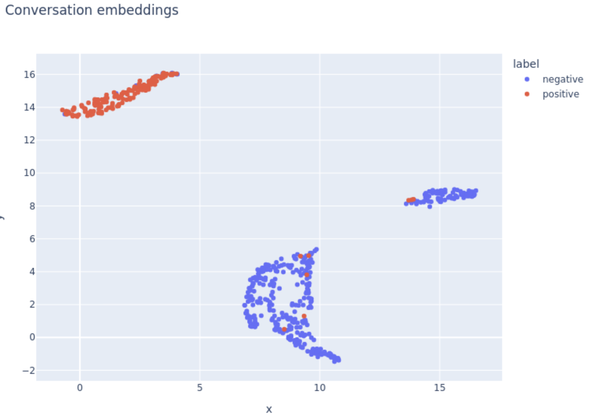

# BERT classifier

1. [Business problem](#sec_1)<br>

## 1. Business problem <a class="anchor" id="sec_1"></a>
When calling overdue clients for collection, sometimes the registered phone number is outdated. This can happen when the client moves to a new home, changes jobs, or the line is taken down and reassigned by the phone company to a new client. In some cases agents keep calling outdated phone numbers, wasting valuable time and creating friction for the called party, who repeatedly informs of the misunderstanding.

## 2. Goal
The goal of this project is to classify phone call conversations into two classes, identifying those cases when the called party informed an outdated/incorrect phone number. Said class is labeld as "positive", while normal conversations are labeled as "negative".

## 3. Approach
A pretrained BERT model was fine-tuned for this binary classification task. The specialized training was performed on transcriptions of conversations, made using Amazon Textract. The base model was [BETO](https://huggingface.co/dccuchile/bert-base-spanish-wwm-cased), a cased Spanish BERT model. This choice was made because the conversations were in Spanish.

Previously this pretrained BERT model had been fine-tuned with our data for the general tasks, i.e, before training for classification. These tasks are Masked Language Modeling (MLM) and Next Sentence Prediction (NSP). There are two notebooks on this repository, with the only difference being that one trains for classification starting from the base model (BETO), while the other one starts with BETO fine-tuned for our data.

## 4. Loss and accuracy curves

In the figures below we can see that after epoch 2 the model started overfitting, with validation loss going up while training loss kept going down. However, the model had its best accuracy in epoch 4.


## 5. Performance metrics
Below we can see the classification report for epoch 4, showing an extremely good performance with a general accuracy of 96% using the base model, and 97% using the fine-tuned version.

```
Classification Report: ds_val
              precision    recall  f1-score   support

    negativo       0.98      0.98      0.98       384
    positivo       0.94      0.95      0.94       149

    accuracy                           0.97       533
   macro avg       0.96      0.96      0.96       533
weighted avg       0.97      0.97      0.97       533
```

## 6. Embedding visualization

Below we can visualize the embedding vectors for each conversation, as generated by the fine-tuned model. Dimensionality was reduced from 768 to 2 in order to allow for a 2D scatter plot. The figure shows a separation of the positive and negative classes, evidencing that BERT learned to differentiate them. Furthermore, it shows two clusters within the negative class, suggesting an underlying additional feature. It is possible that there are two groups of causes why a phone number turns out to be incorrect. For instance, it could be that in some cases the called party has never known the client, whereas in other cases it could be a family member or former coworker reporting that the client is no longer to be found at that address. 

